# Apparel & Manufacturing ERP — Complete Operations & Workflow Guide

> **System Overview**: An end-to-end multi-tenant ERP platform designed for apparel brands and garment manufacturing factories. It seamlessly connects Product Design, Pattern Making, Sampling, Bill of Materials (BOM), Procurement, Warehouse Management, Production, Quality Assurance, and Logistics.

---

## Table of Contents
1. [End-to-End System Workflow Diagram](#1-end-to-end-system-workflow-diagram)
2. [User Roles & Access Matrix](#2-user-roles--access-matrix)
3. [Master Data & Initial Configuration](#3-master-data--initial-configuration)
4. [Step-by-Step Operations Flow](#4-step-by-step-operations-flow)
   - [Step 1: Product Design & Tech Pack Development](#step-1-product-design--tech-pack-development)
   - [Step 2: Pattern Engineering & CAD Verification](#step-2-pattern-engineering--cad-verification)
   - [Step 3: Sampling & Fit Approvals](#step-3-sampling--fit-approvals)
   - [Step 4: Commercialization — SKU Matrix & BOM](#step-4-commercialization--sku-matrix--bom)
   - [Step 5: Procurement & Raw Material Inwarding (P2P)](#step-5-procurement--raw-material-inwarding-p2p)
   - [Step 6: Production Planning & Shop-Floor Execution](#step-6-production-planning--shop-floor-execution)
   - [Step 7: Quality Assurance & CAPA Management](#step-7-quality-assurance--capa-management)
   - [Step 8: Warehouse Operations, Stock Locator & Dispatch](#step-8-warehouse-operations-stock-locator--dispatch)
5. [Cross-Functional Modules](#5-cross-functional-modules)
   - [Multi-Level Approvals Hub](#multi-level-approvals-hub)
   - [Audit Trails & Security](#audit-trails--security)
   - [Reports, KPIs & Analytics](#reports-kpis--analytics)
   - [Real-Time Factory Chat & Notifications](#real-time-factory-chat--notifications)
6. [Summary Checklist for Daily Operations](#6-summary-checklist-for-daily-operations)

---

## 1. End-to-End System Workflow Diagram

```mermaid
flowchart TD
    %% Phase 1
    subgraph P1["Phase 1: Design & Tech Pack"]
        D1["Create Design (/designs/new)"] --> D2["Add Specs, Size Chart & Variants"]
        D2 --> D3["Submit for Approval"]
        D3 --> D4{"Design Review"}
        D4 -- "Revision" --> D2
        D4 -- "Approved" --> D5["Release Version (Locks Tech Pack)"]
    end

    %% Phase 2
    subgraph P2["Phase 2: Pattern Making"]
        D5 --> PT1["Assign Pattern Master (/pattern)"]
        PT1 --> PT2["Marker Planning & Lay Efficiency"]
        PT2 --> PT3["Verify Sizing, Grading & Consumption"]
        PT3 --> PT4["Sign off Authoritative Tech Pack (COMPLETED)"]
    end

    %% Phase 3
    subgraph P3["Phase 3: Sampling & Fit Trials"]
        PT4 --> S1["Create Sample Request (/samples)"]
        S1 --> S2["Submit RM Requirements"]
        S2 --> S3["Sample RM Approval & Store Issue"]
        S3 --> S4["Cutting & Sample Stitching"]
        S4 --> S5["Sample QC Inspection & Fit Trial"]
        S5 --> S6{"Buyer / Fit Approval"}
        S6 -- "Revision" --> S1
        S6 -- "Approved" --> S7["Sample Approved (Bulk Ready)"]
    end

    %% Phase 4
    subgraph P4["Phase 4: SKUs & Production BOM"]
        S7 --> K1["Generate Commercial SKU Matrix (/products/skus)"]
        K1 --> B1["Create Production BOM (/products/boms)"]
        B1 --> B2["Add Materials, Trims & Wastage %"]
        B2 --> B3["Run MRP Preview (Check Stock Shortages)"]
        B3 --> B4["Approve & Activate BOM"]
    end

    %% Phase 5
    subgraph P5["Phase 5: Procurement (P2P)"]
        B3 -. "Shortage Detected" .-> PR1["Create Purchase Requisition (/purchase)"]
        PR1 --> PR2["L1 / L2 Approval"]
        PR2 --> PO1["Issue Purchase Order (PO / RFQ)"]
        PO1 --> GRN1["Vendor Delivers -> Create GRN"]
        GRN1 --> QC1["Incoming QC Inspection (/quality)"]
        QC1 --> PA1["Put-Away to Storage Bin (/warehouse)"]
    end

    %% Phase 6
    subgraph P6["Phase 6: Production Execution"]
        B4 --> PROD1["Create Production Order (/production/orders)"]
        PA1 -. "Stock Available" .-> PROD2
        PROD1 --> PROD2["Run Order MRP & Reserve RM"]
        PROD2 --> PROD3["Production Order Approval"]
        PROD3 --> PROD4["Schedule Lines & Machines (/production/machines)"]
        PROD4 --> PROD5["Create Production Batches / Job Cards"]
        PROD5 --> PROD6["Stages: Cutting -> Sewing -> Finishing -> Packing"]
        PROD6 --> PROD7["Track Waste & Offcuts (/waste)"]
    end

    %% Phase 7 & 8
    subgraph P7["Phase 7 & 8: Final QC, Warehousing & Outbound"]
        PROD6 --> FQC1["End-of-Line / Batch QC Inspection"]
        FQC1 -- "Defect Detected" --> CAPA1["Log CAPA (/quality/capa)"]
        FQC1 -- "Passed" --> FG1["FG Put-Away to Warehouse Bins"]
        FG1 --> SL1["Stock Locator & Bin Tracking"]
        SL1 --> DISP1["Stage, Pick & Dispatch Outbound (/warehouse/operations/dispatch)"]
    end
```

---

## 2. User Roles & Access Matrix

| Role | Primary Responsibilities | Key Pages Used |
| :--- | :--- | :--- |
| **Super Admin / Factory Admin** | Full tenant configuration, shifts, users, permissions, workflow levels, global approvals | `/admin`, `/settings`, `/users`, `/approvals` |
| **Fashion Designer / Merchandiser** | Create design concepts, tech packs, specs, colorways, initial costings, sample reviews | `/designs`, `/samples`, `/approvals` |
| **Pattern Master** | CAD files, marker efficiency, size grading, cloth consumption verification | `/pattern`, `/designs` |
| **Sample Tailor / Sampling Lead** | Fabric receipt, cut lays, prototype stitching, sample QC preparation | `/samples` |
| **Store Keeper / Warehouse Operator**| Material receipts (GRN), bin put-away, stock picking, transfers, cycle counts, dispatch | `/inventory`, `/warehouse/*`, `/purchase` |
| **Purchase Manager** | Supplier onboarding, RFQs, price negotiations, purchase requisitions, PO creation | `/purchase`, `/vendors`, `/approvals` |
| **Production Manager / Supervisor** | Job cards, line assignments, machine allocation, shift schedules, batch tracking | `/production/*`, `/waste` |
| **Quality Inspector (QC)** | Fabric testing (4-point/10-point), incoming GRN QC, inline audits, AQL final inspection, CAPA | `/quality/*`, `/quality/capa` |

---

## 3. Master Data & Initial Configuration

Before running daily transactions, set up the master records in this sequence:

### 3.1 Organization & Factory Profile
1. Navigate to **Admin** (`/admin/organizations`) or **Settings** (`/settings/general`).
2. Define:
   - Company Name, Currency (e.g., `INR`, `USD`), Timezone, Fiscal Year start.
   - Measurement Units (e.g., `Meters`, `Kg`, `Pcs`, `Yards`, `Cones`).
   - Low stock threshold days.

### 3.2 Users & Permissions
1. Go to **Factory Users** (`/users`).
2. Click **Add User** -> Enter First Name, Last Name, Email, Employee ID, and Temporary Password.
3. Assign Roles for the specific factory (`Merchandiser`, `Pattern Master`, `Store Keeper`, `Production Manager`, etc.).

### 3.3 Inventory Codes & Numbering Presets
1. Go to **Settings > Inventory Codes** (`/settings/inventory-codes`).
2. Configure standard dropdown values for:
   - **Material Categories**: Fabric, Trims, Accessories, Packaging, Chemicals.
   - **Defect Categories**: Hole, Stain, Broken Stitch, Shade Variation, Uneven Hem.
   - **SKU Formula Segments**: Style Number + Color Code + Size.

### 3.4 Warehouses, Zones, Racks & Bins
1. Go to **Warehouse > Sites & Layout** (`/warehouse/warehouses`).
2. Create **Raw Material Warehouse** (Type: `RAW_MATERIAL`) and **Finished Goods Warehouse** (Type: `FINISHED_GOODS`).
3. Under each warehouse, create hierarchy:
   - **Zone** (e.g., `Zone A - Woven Fabrics`, `Zone B - Trims`)
   - **Rack** (e.g., `Rack R01`)
   - **Shelf** (e.g., `Shelf S1`)
   - **Storage Bin** (e.g., `Bin A-R01-S1-01` with barcode generation)

### 3.5 Machines & Production Lines
1. Go to **Production > Machines** (`/production/machines`).
2. Add machines with Machine Type (`CUTTING`, `SEWING`, `PRINTING`, `EMBROIDERY`, `IRONING`), hourly capacity, and line assignment.
3. Define Factory Shifts (e.g., Morning Shift: 08:00 - 16:30, Evening Shift: 16:30 - 01:00).

---

## 4. Step-by-Step Operations Flow

---

### Step 1: Product Design & Tech Pack Development

**Where**: Navigation menu -> **Designs** (`/designs`) -> Click **"New Design"** (`/designs/new`)

#### How to Add Step-by-Step:
1. **Basic Details Tab**:
   - **Design Code**: Unique identifier (e.g., `DSGN-2026-001`).
   - **Title & Description**: e.g., `Slim Fit Oxford Cotton Shirt`.
   - **Category & Sub-Category**: e.g., `Men's Apparel` -> `Casual Shirts`.
   - **Gender & Age Group**: `Men`, `Adult`.
   - **Fit & Silhouette**: `Slim Fit`, `Long Sleeve`, `Button-Down Collar`.
   - **Season & Collection**: Link to `Spring/Summer 2026` and `Urban Classic`.
2. **Product Specs Tab**:
   - Fabric GSM (e.g., `140`), Fabric Finish (`Soft Enzyme Wash`), Shrinkage % (`< 2%`).
   - Printing / Embroidery instructions, Wash care instructions (`Machine wash warm 40°C`).
3. **Size Chart Tab**:
   - Select measurement unit (`cm` or `inches`).
   - Define size labels: `S`, `M`, `L`, `XL`, `XXL`.
   - Fill measurement rows: Chest, Waist, Length, Shoulder, Sleeve Length.
4. **Color Variants Tab**:
   - Add colorways: Name (`Sky Blue`, `Optic White`), Pantone Code (`14-4115 TCX`), Hex (`#87CEEB`).
5. **Assets / Files Tab**:
   - Upload Flat Sketches (Front & Back), Tech Pack PDFs, 3D Renders, Artwork vector files.
6. **Submit for Approval**:
   - Click **"Submit Tech Pack for Approval"**.
   - Design status shifts from `DRAFT` to `IN_REVIEW`.
   - Designated Merchandiser/Manager reviews and clicks **"Approve"** (or **"Request Revision"** with notes).
7. **Release Version**:
   - Once approved, click **"Release Version"**.
   - This freezes the baseline tech pack as **v1.0** and unlocks the next stage: Pattern Development.

---

### Step 2: Pattern Engineering & CAD Verification

**Where**: Navigation menu -> **Pattern** (`/pattern`)

#### How to Add Step-by-Step:
1. **Assign Pattern Master**:
   - Locate the newly released design in the **Active Queue**.
   - Select the **Pattern Master** and click **"Assign Master"**.
2. **Open Pattern Workspace**:
   - Click **"Open Pattern Workspace"** on the design card.
3. **Marker Planning & CAD Files**:
   - Upload CAD plot file / Gerber marker files.
   - Enter Fabric Width (e.g., `58 inches`), Marker Length, Pieces per Marker.
   - Record Marker Efficiency percentage (e.g., `86.5%`).
4. **Verify Consumption & Grading**:
   - Verify size chart dimensions across all graded sizes against shrinkage allowance.
   - Enter calculated consumption per garment: e.g., `1.45 meters/shirt` (+ `5%` cutting wastage).
   - Enter trim consumption: e.g., `8 buttons/shirt`, `0.25m fusing/shirt`.
5. **Sign-off Authoritative Tech Pack**:
   - Tick checkboxes:
     - `[x] Size Chart Verified`
     - `[x] Fabric Consumption Verified`
     - `[x] Sample BOM Lines Verified`
   - Click **"Complete Pattern Development"**.
   - Status updates to `COMPLETED`. Pattern is now locked and ready for physical sampling.

---

### Step 3: Sampling & Fit Approvals

**Where**: Navigation menu -> **Sampling** (`/samples`)

#### How to Add Step-by-Step:
1. **Create Sample Request**:
   - Click **"Create Sample"**.
   - Select Design (filtered to completed patterns).
   - Choose Sample Type:
     - `PROTOTYPE`: Initial silhouette & construction check.
     - `FIT_SAMPLE`: Tested on live fit model / mannequin.
     - `PRE_PRODUCTION (PP)`: Final approval before bulk production runs.
   - Enter planned labor hours and rate.
2. **Submit Material Requirements**:
   - Inside the Sample Workspace, review required raw materials (Fabric, Buttons, Interlining).
   - Click **"Submit RM Request"** (`MATERIAL_REQUEST_PENDING`).
3. **Approval & Store Handoff**:
   - Approver accepts the material request (`MATERIAL_REQUEST_APPROVED`).
   - Store Keeper clicks **"Reserve Stock"** -> **"Issue to Cutting"** (`MATERIAL_RESERVED` -> `CUTTING`).
4. **Sample Stitching**:
   - Sample master cuts lay and tailors garment (`IN_PROGRESS`).
   - Mark as **"Stitching Completed"** (`QC_PENDING`).
5. **Sample QC & Fit Trial**:
   - QC Inspector checks measurement tolerances (+/- 0.5 cm), stitch SPI, collar symmetry.
   - Fit Specialist records Fit Analysis:
     - Overall Result: `APPROVED`, `MINOR_ALTERATIONS`, or `REJECTED`.
     - Log specific fit issues (e.g., "Sleeve bicep tight by 1 cm").
6. **Buyer / Management Sign-off**:
   - Click **"Approve Sample"**.
   - Sample status updates to `APPROVED` ("Bulk Ready").
   - This unlocks Commercial SKU generation and Production Orders!

---

### Step 4: Commercialization — SKU Matrix & BOM

#### 4.1 Generate Commercial SKUs
**Where**: Navigation menu -> **Products > SKUs** (`/products/skus`)
1. In the **"Generate from Approved Sample"** banner, select your approved sample.
2. Review the auto-generated SKU Matrix preview:
   - e.g., `DSGN-001-BLU-S`, `DSGN-001-BLU-M`, `DSGN-001-BLU-L`, `DSGN-001-WHT-S`...
3. Enter the standard **Base Price** (e.g., `1299.00 INR`).
4. Click **"Generate SKUs"**. Commercial SKUs are created with unique barcodes and active status.

#### 4.2 Create Production Bill of Materials (BOM)
**Where**: Navigation menu -> **Products > BOMs** (`/products/boms`)
1. Click **"Create BOM"**.
2. Select the target **Active SKU**.
3. Add BOM Lines:
   - Select Material (e.g., `100% Oxford Cotton Fabric - Sky Blue`).
   - Quantity per piece: `1.45 meters`.
   - Wastage allowance: `4.0%`.
   - Add auxiliary items: Polyester sewing thread (120m), Shell buttons (8 pcs), Care label (1 pc), Collar stay (2 pcs), Polybag (1 pc).
4. System automatically aggregates:
   $$\text{Total Cost Per Piece} = \sum (\text{Qty} \times (1 + \text{Wastage}\%) \times \text{Unit Cost})$$
5. **Run MRP Check**:
   - Click **"MRP Preview"** to inspect current warehouse stock for each line item.
   - If stock is sufficient -> Green indicator.
   - If any shortage is detected -> Red alert highlighting exact shortage quantity.
6. Click **"Submit BOM for Approval"** -> **"Approve & Activate"**.

---

### Step 5: Procurement & Raw Material Inwarding (P2P)

**Where**: Navigation menu -> **Purchase** (`/purchase`)

#### 5.1 Purchase Requisition (PR)
1. Go to **PR Tab** -> Click **"New Requisition"**.
2. Select Material, enter required quantity, delivery deadline, and purpose (e.g., "Shortage for Production Order #104").
3. Submit PR. Routed to L1 Purchase Manager -> L2 Factory Admin for sign-off.

#### 5.2 RFQ & Purchase Order (PO)
1. Once PR is approved, convert PR directly into a **Purchase Order (PO)** or send **RFQ** to multiple vendors.
2. Select approved **Vendor** from master list (`/vendors`).
3. Set agreed unit price, tax, freight terms, and expected delivery date.
4. Click **"Issue PO"** -> PO status updates to `OPEN`.

#### 5.3 Goods Receipt Note (GRN)
1. When delivery truck arrives at factory receiving dock:
2. Go to **GRN Tab** -> Click **"Create GRN"**.
3. Select the Open PO Number.
4. Enter physically received quantities per line item (partial receipts supported).
5. Click **"Log Receipt"** -> GRN created with status `PENDING_QC`. Items sit in **Unallocated Receiving Dock**.

#### 5.4 Incoming Quality Control (Incoming QC)
1. QC Inspector navigates to **Quality > Incoming QC** (`/quality/inspections`).
2. Opens the pending GRN:
   - Tests fabric roll for defects using standard 4-point system.
   - Checks color shade against Pantone master under D65 light box.
   - Measures width and fabric weight (GSM).
3. Enters **Passed Quantity** and **Defect Quantity** (if any).
4. Click **"Submit QC Disposition"**:
   - Passed quantity is certified and transferred into active Raw Material balance.
   - Defective quantity is flagged for vendor return / credit note.

#### 5.5 Put-Away to Storage Bin
1. Go to **Warehouse > Put Away** (`/warehouse/operations/put-away`).
2. Select received material from Dock list.
3. Select target Storage Bin (e.g., `Zone A -> Rack 02 -> Shelf 03 -> Bin A-R02-S3-01`).
4. Click **"Confirm Put-Away"**. Stock is now officially located in the bin and visible to MRP.

---

### Step 6: Production Planning & Shop-Floor Execution

**Where**: Navigation menu -> **Production > Orders** (`/production/orders`)

#### 6.1 Create Production Order
1. Click **"Create Order"**.
2. Select SKU, Planned Quantity (e.g., `500 pcs`), Priority (`HIGH`), and Target Delivery Date.
3. Order created with status `CREATED`.

#### 6.2 Material Requirements Planning (MRP) & Stock Reservation
1. On the order row, click **"Run MRP"**:
   - System checks active BOM lines against available stock.
   - Status moves to `MRP_DONE`.
2. Click **"Reserve Raw Materials"**:
   - Allocates the exact quantities of fabric, thread, and buttons in warehouse inventory.
   - Stock moves from `Available` to `Reserved`.
   - Status moves to `MATERIAL_RESERVED`.
3. Submit order for approval -> Manager clicks **"Approve Order"** (`APPROVED`).

#### 6.3 Machine Allocation & Shift Scheduling
1. Go to **Schedules Tab** (`/production/schedule`) or **Machines** (`/production/machines`).
2. Assign Production Line (e.g., `Sewing Line 02`) and key machines.
3. Select Shift (e.g., `Morning Shift`) and planned start/end dates.

#### 6.4 Issue Batches / Job Cards to Shop Floor
1. On approved order, click **"Create Batch"** (e.g., Batch 1: `250 pcs`, Batch 2: `250 pcs`).
2. Warehouse Operator uses **Picking** (`/warehouse/operations/picking`) to issue reserved materials to the cutting floor.
3. Batch moves through sequential shop-floor stages on the **Kanban Board** (`/production` -> `Board` tab):
   - **Stage 1: Cutting**: Marker lay, fabric spreading, cutting, bundling & ticketing.
   - **Stage 2: Sewing**: Assembly line stitching (collar preparation, sleeve setting, side seams, buttonholing).
   - **Stage 3: Finishing**: Thread trimming, stain cleaning, pressing/ironing.
   - **Stage 4: Packing**: Swing tag attachment, barcode sticker, folding, polybag packing.
4. Record Fabric Cutting Waste (`/waste`): Log fabric offcuts or end-bits with recovery action (Recycle / Resell).

---

### Step 7: Quality Assurance & CAPA Management

**Where**: Navigation menu -> **Quality** (`/quality`)

#### 7.1 In-Line & End-of-Line Inspection
1. Go to **Quality Inspections** (`/quality/inspections`).
2. Click on the active Production Batch.
3. Use pre-configured **Inspection Templates** (`/quality/templates`):
   - Stitch density (SPI check: 12-14 stitches/inch).
   - Seam slippage, puckering, needle cutting.
   - Critical garment dimensions (Chest, Neck circumference, Sleeve length).
   - Symmetry and label placement accuracy.
4. Enter Results:
   - **Passed Quantity**: Approved for warehouse packaging.
   - **Rework Quantity**: Sent back to stitching line for repair.
   - **Scrap / Failed Quantity**: Unrecoverable defects.

#### 7.2 Corrective and Preventive Actions (CAPA)
**Where**: Navigation menu -> **Quality > CAPA** (`/quality/capa`)
1. If repeated defects occur (e.g., frequent needle holes on knit fabric):
2. Click **"New CAPA"**.
3. Fill details:
   - Defect Type & Severity (Critical / Major / Minor).
   - Root Cause Analysis (e.g., "Wrong ball-point needle gauge used for fine jersey").
   - Immediate Corrective Action (Replace needles on Line 02 with size 70/10 ball-point).
   - Preventive Action (Update machine setup checklist prior to batch loading).
   - Assign Owner and Due Date.
4. Review and close once verified.

---

### Step 8: Warehouse Operations, Stock Locator & Dispatch

**Where**: Navigation menu -> **Warehouse** (`/warehouse/*`)

#### 8.1 Finished Goods (FG) Put-Away
1. Go to **Warehouse > Put Away** (`/warehouse/operations/put-away`).
2. Switch toggle to **Finished Goods**.
3. Select the QC-passed production batch.
4. Assign designated FG Storage Bin (e.g., `FG-Zone-Rack01-Bin05`).
5. Confirm Put-Away.

#### 8.2 Stock Locator
1. Go to **Warehouse > Stock Locator** (`/warehouse/stock-locator`).
2. Instant search by SKU Code, Barcode, Material Name, or Storage Bin.
3. View real-time breakdown: `On-Hand`, `Reserved`, `Available`, and exact physical location (Zone, Rack, Shelf, Bin).

#### 8.3 Order Picking & Outbound Dispatch
1. Go to **Warehouse > Dispatch** (`/warehouse/operations/dispatch`).
2. Select target customer order / retail replenishment batch.
3. System generates **Pick List** with bin locations for fast warehouse routing.
4. Warehouse operator picks SKUs -> Marks items as **"Staged / Ready to Ship"**.
5. When carrier arrives, click **"Dispatch Outbound"**:
   - Inventory balance automatically decrements.
   - Delivery challan / dispatch docket generated.
   - Production Order status transitions to `COMPLETED`.

---

## 5. Cross-Functional Modules

### Multi-Level Approvals Hub
- Located at `/approvals`.
- Unified inbox for managers to approve **Designs**, **Sample Materials**, **Purchase Requisitions**, **Purchase Orders**, **BOMs**, and **Production Orders**.
- Supports SLA tracking, delegation of authority, and multi-tier approval hierarchies (L1, L2, L3).

### Audit Trails & Security
- Located at `/audit`.
- Immutable log recording:
  - User identity, action (`CREATE`, `UPDATE`, `APPROVE`, `REJECT`).
  - Module, timestamp, IP address.
  - Full before-and-after diff of data changes.

### Reports, KPIs & Analytics
- Located at `/reports/*`.
- Interactive dashboards for key factory metrics:
  - **Factory Tab**: Overall order fulfillment %, active batches, open PO value, QC yield.
  - **Production Tab**: Planned vs. actual output, line utilization, operator efficiency.
  - **Inventory Tab**: RM & FG valuation, stock aging, low stock / out-of-stock alerts.
  - **Quality Tab**: First Pass Yield (FPY), top defect pareto charts, vendor rejection rates.
  - **Financial Tab**: Total procurement spend, waste cost, net working inventory exposure.

### Real-Time Factory Chat & Notifications
- Chat available at `/chat` and via floating factory widget.
- Instant channel communication between Merchandisers, Pattern Masters, Cutting Leads, Store Keepers, and Supervisors.
- Automated push notifications for low stock alerts, approval requests, and QC rejections.

---

## 6. Summary Checklist for Daily Operations

| Phase | Milestone Action | Completed By | Success Verification |
| :--- | :--- | :--- | :--- |
| **Design** | Create tech pack, size chart, colorways & submit | Merchandiser | Design status = `RELEASED` |
| **Pattern** | Upload CAD, verify marker efficiency & consumption | Pattern Master | Pattern status = `COMPLETED` |
| **Sampling** | Request sample, issue RM, stitch, fit test & sign off | Sampling Team | Sample status = `APPROVED` |
| **Catalog** | Generate SKU matrix & create production BOM | Merchandiser / Planner | BOM status = `ACTIVE` |
| **Procurement** | Requisition materials, issue PO, receive GRN, pass QC | Store / Purchasing | RM in Bin, Available stock > 0 |
| **Production** | Reserve RM, assign line & machine, cut, sew, pack | Production Manager | Batch stages complete |
| **Quality** | Inspect batch against checklist, log defects/CAPA | QC Inspector | Batch status = `PASSED` |
| **Logistics** | Put-away to FG bin, pick order, dispatch to buyer | Warehouse Team | Dispatch status = `COMPLETED` |

---
*Document Version: 1.0.0*  
*Last Updated: 2026-09-28*  
*ERP Factory Frontend & Operations Standard Operating Procedure (SOP)*
